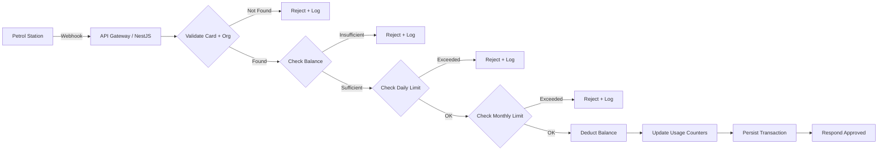
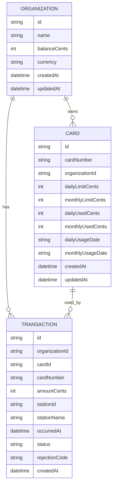
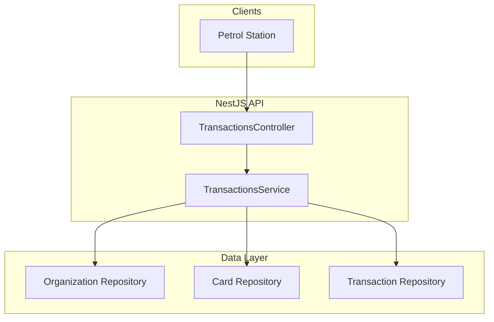

# Fast-Logic MyFuel Service

## Overview
This repo implements the core webhook service for processing fuel transactions in Fast-Logic's MyFuel platform. It validates organization balance and card limits, updates usage counters, and returns an approval or rejection response. The implementation uses PostgreSQL with TypeORM for persistence.

## Features Implemented
- Transaction webhook endpoint with validation
- Balance and daily/monthly limit checks
- Daily/monthly limit resets based on transaction date
- Swagger API documentation
- Unit and e2e tests
- GitHub Actions CI pipeline
- PostgreSQL persistence via TypeORM
- Redis cache for card/organization lookups

## System Design (Part 1)
### Flow Diagram


### ERD


### System Architecture


## API
### POST /webhooks/transactions
Validates and processes a transaction.

Example payload:
```json
{
  "cardNumber": "4111111111111111",
  "amount": 45.25,
  "occurredAt": "2026-01-31T08:15:30.000Z",
  "stationId": "station_123",
  "stationName": "Shell Downtown",
  "externalTransactionId": "ext_98765"
}
```

Example approved response:
```json
{
  "status": "approved",
  "code": "APPROVED",
  "message": "Transaction approved",
  "transactionId": "txn_...",
  "balanceCents": 499000,
  "cardUsage": {
    "dailyUsedCents": 1000,
    "monthlyUsedCents": 1000,
    "dailyLimitCents": 20000,
    "monthlyLimitCents": 300000
  }
}
```

Example rejected response:
```json
{
  "status": "rejected",
  "code": "INSUFFICIENT_BALANCE",
  "message": "Insufficient organization balance",
  "transactionId": "txn_..."
}
```

Swagger docs: `http://localhost:3000/docs`

## Seed Data
The service seeds a single organization with two cards on startup:
- Organization: `org_acme` (balance `500000` cents)
- Card `4111111111111111` (daily limit `20000`, monthly limit `300000`)
- Card `5555555555554444` (daily limit `50000`, monthly limit `500000`)

## Assumptions and Notes
- Amounts are accepted with up to 2 decimal places and stored as integer cents.
- Daily/monthly resets are based on the transaction timestamp in UTC.
- PostgreSQL + TypeORM are used with `synchronize` enabled for local development.
- Transactions are stored for historical tracking and auditing.
- The service uses a Unit of Work transaction to keep balance, usage, and transaction writes atomic.
- Concurrency control (e.g., row-level locks) is needed in production to prevent race conditions.
- The model is designed to be extended with new limit types (weekly, vehicle-level, org aggregate).
- Redis caching and idempotency keys are recommended for high throughput.

## Running Locally
```bash
npm install
npm run start:dev
```

### Database Configuration
Defaults (can be overridden via environment variables):
- `DB_HOST=localhost`
- `DB_PORT=5432`
- `DB_USER=postgres`
- `DB_PASSWORD=admin`
- `DB_NAME=fast_logic`
- `DB_SYNC=true`

### Redis Configuration
Defaults (can be overridden via environment variables):
- `REDIS_ENABLED=true`
- `REDIS_HOST=localhost`
- `REDIS_PORT=6379`
- `REDIS_PASSWORD=`
- `REDIS_DB=0`
- `REDIS_TTL_SECONDS=300`

## Tests
```bash
npm run test
npm run test:e2e
```

## CI/CD
A GitHub Actions pipeline is provided in `.github/workflows/ci.yml` to run linting, tests, and builds on every push or pull request.
